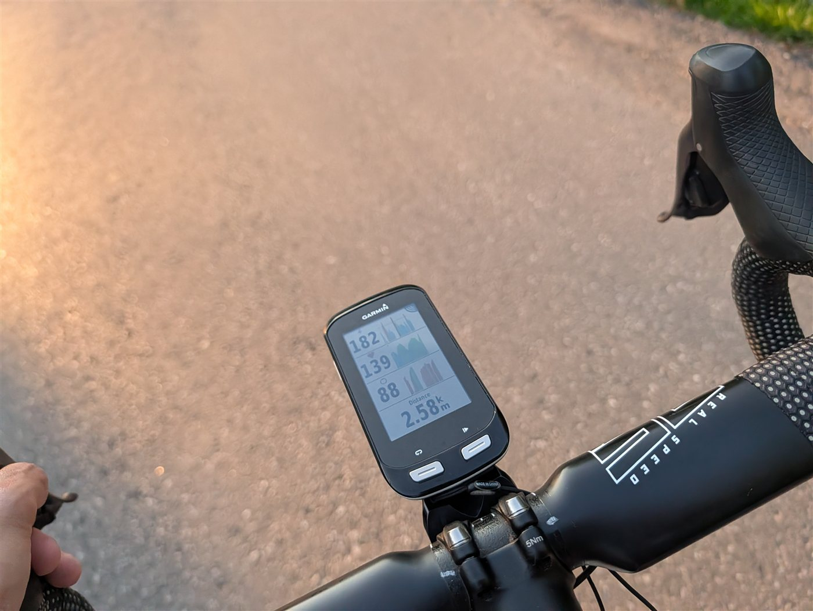
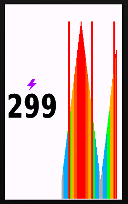
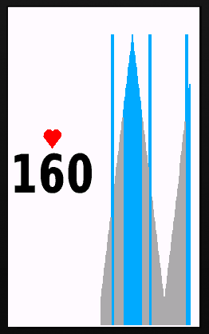
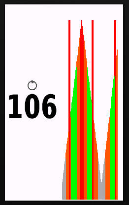

# Varia-Safe Graphs for the Garmin Edge 1000

Three Connect IQ data fields, **Power**, **Cadence**, and **Heart Rate**, that bring big, legible, **live graph visualizations** to the aging **Garmin Edge 1000**, and keep your numbers readable even when a Garmin Varia radar is warning you about traffic behind.

> Made for Edge 1000 owners who want the kind of graph dashboards the newer Edge units (1040/1050) have, and **especially for anyone whose eyes aren't what they used to be.** Big numbers, clear colours, glance and go.



*The real glance test, on the road: Power 182 / Heart Rate 139 / Cadence 88, each with its own live graph, plus distance. Readable at speed in real light.*

The three fields up close (simulator):

| Power | Heart Rate | Cadence |
|:---:|:---:|:---:|
|  |  |  |

*The three fields with live (simulated) data: small metric icon + big number on the left, colour-coded auto-scaling graph on the right.*

## Why this exists

The Edge 1000 (2014) **can't run modern Connect IQ graph dashboards**, its hardware and API are too old, and the store's "compatible devices" list is misleading (modern fields appear installable but won't actually run on it). On top of that, the stock graph fields are small and render the current value on the **right edge**, which is exactly where a **Varia radar draws its threat bar**, hiding the number you most want to see when a car is behind you.

These fields fix both problems: a **big number on the left** (always readable, where the radar overlay can't reach) with a **live, colour-coded graph** filling the rest.

## What each field gives you

- **Big auto-sized number** in the device's largest font, with a small metric icon stacked above it (lightning / heart / rotation ring).
- **Live rolling graph** that **auto-scales** to your recent data so the variation always fills the height, smoothed so the axis glides instead of jittering.
- **Zone colours that carry the meaning**, so the floating graph stays honest:
  - **Power** — Coggan-style zones by % FTP.
  - **Heart Rate** — your **actual device HR zones**, read from your Garmin profile and auto-updating.
  - **Cadence** — a configurable **target band** (default green 85-100 rpm) to encourage a smooth, higher spin; fully tunable and switchable to plain grey.
- **Varia-safe layout**: numbers stay on the left; a small right margin (default 10px) is kept clear for the radar bar.

## Compatibility

Built and ridden on the **Edge 1000 / Explore 1000**. The manifests also target Edge 520/820/1030/530/830/520 Plus and should run there (PRs welcome).

One hardware limit worth knowing: the Edge 1000's API has **no power-zone access** (`getPowerZones` is a newer-device call), so **FTP is a manual setting** on the 1000. HR zones *do* auto-read.

## Settings

Edit in Garmin Express (device → the field's settings):

| Setting | Default | Applies to |
|---|---|---|
| FTP (watts) | 200 | Power, set yours; the 1000 can't auto-read it |
| Max HR fallback (bpm) | 185 | HR, only used if zones aren't available |
| Graph window (seconds) | 120 | all |
| Right margin px (Varia) | 10 | all |
| Cadence: colour bars | on | Cadence, off = clean grey |
| Cadence grey/green/red cutoffs | 70 / 85 / 100 / 110 | Cadence |

The three fields share one settings list, so each shows the others' options too; just ignore the ones that don't apply.

## Build it

Requires the [Connect IQ SDK](https://developer.garmin.com/connect-iq/sdk/) (provides `monkeyc`) and a JDK. See [`NEXT-STEPS.md`](NEXT-STEPS.md) for SDK/JDK/device-id gotchas.

1. Generate a developer key once:
   ```sh
   openssl genrsa -out developer_key.pem 4096
   openssl pkcs8 -topk8 -inform PEM -outform DER -in developer_key.pem -out developer_key -nocrypt
   ```
2. Build all three:
   ```sh
   ./build.sh            # or build.ps1   ->  bin/VariaSafe-power.prg, -cadence.prg, -hr.prg
   ```

## Install it

Connect the Edge over USB and copy whichever fields you want:

```sh
cp bin/VariaSafe-*.prg /<EDGE>/GARMIN/Apps/
```

Eject, unplug, then assign each to a **1- or 2-field data screen → Connect IQ** (fewer fields per screen = bigger numbers). Sideloading is the only reliable install path for the Edge 1000.

## How it was made

Built collaboratively by **Rob Burke** and Claude Code over a couple of evenings, from "my hand-me-down Edge 1000 is hard to read on the road" to a compiled, sideloaded, three-field graph suite. The data-visualization choices, dynamic autoscale with zone colour, the sparkline-style layout, the cadence target band, lean on Edward Tufte's principles and a bit of cycling-coaching research.

## License

MIT, see [LICENSE](LICENSE). Share, fork, and improve, especially if it helps you keep your eyes on the road.
